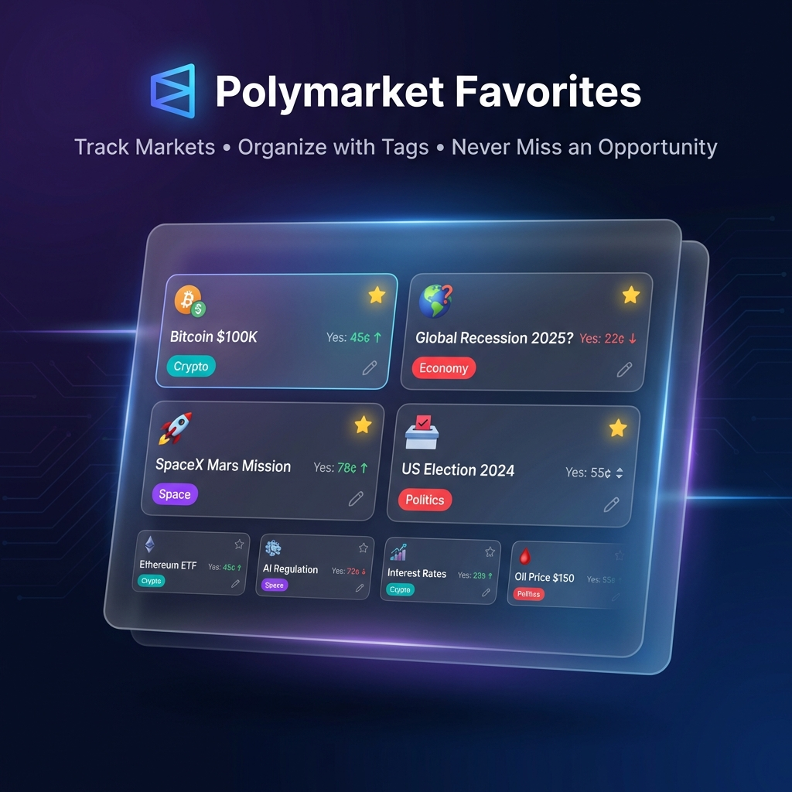

# Polymarket Favorites

<p align="center">
  
</p>

<p align="center">
  <a href="#installation"></a>
  <a href="#chrome-extension"></a>
  
  
</p>

<p align="center">
  <strong>The missing favorites feature for Polymarket.</strong><br>
  Track markets and traders • Organize with colorful tags • Never miss an opportunity
</p>

---

[English](#english) | [中文](#中文)

---

<a name="english"></a>

## 🎯 What is this?

Polymarket Favorites adds a powerful **favorites sidebar** to Polymarket.com. Save markets and traders you want to follow, organize them with custom tags, and access them from any page.

## ✨ Features

### Core Features
| Feature | Description |
|---------|-------------|
| ⭐ **One-Click Favorites** | Save any market or trader with a single click |
| 🖼️ **Auto Logo Capture** | Automatically saves market icons and trader avatars |
| 🏷️ **Colorful Tags** | Organize with auto-colored tags (red, teal, purple, etc.) |
| ✏️ **Custom Notes** | Add personal notes and rename items |
| 🔍 **Search & Filter** | Find items by name or filter by tag |

### Panel Features
| Feature | Description |
|---------|-------------|
| ↔️ **Resizable Width** | Drag the left edge to adjust panel width |
| ↕️ **Resizable Height** | Drag the top edge to adjust panel height |
| ↖️ **Corner Resize** | Drag top-left corner to adjust both at once |
| 💾 **Persistent Size** | Your panel size is remembered |

### Data & Privacy
| Feature | Description |
|---------|-------------|
| 📤 **Export/Import** | Backup and restore your data as JSON |
| 🌐 **Bilingual** | Switch between English (EN) and Chinese (中) |
| 🔒 **100% Local** | All data stored locally, zero network requests |

---

<a name="installation"></a>

## 🚀 Installation

### Option 1: Userscript (Tampermonkey)

1. Install [Tampermonkey](https://www.tampermonkey.net/) browser extension
2. **[Click here to install the script](https://github.com/dunova/polymarket-favorites/raw/main/polymarket-assistant.user.js)**
3. Visit [Polymarket](https://polymarket.com) - you'll see the assistant toolbar

### Option 2: Chrome Extension

<a name="chrome-extension"></a>

1. Download `chrome-extension` folder from this repo
2. Go to `chrome://extensions/` in Chrome
3. Enable "Developer mode" (top right)
4. Click "Load unpacked" and select the `chrome-extension` folder

---

## 📖 How to Use

### Saving Favorites
1. Navigate to any **market page** or **trader profile**
2. Click the **⭐ Favorite** button in the floating toolbar
3. The item is saved with its icon automatically captured

### Managing Favorites
1. Click the **☰** menu button to open the favorites panel
2. Switch between **Markets** and **Traders** tabs
3. Click **✏️** to edit name and tags
4. Click **✕** to delete

### Resizing the Panel
- **Width**: Drag the **left edge** of the panel
- **Height**: Drag the **top edge** of the panel
- **Both**: Drag the **top-left corner**

---

<a name="中文"></a>

## 🇨🇳 中文说明

### 这是什么？

Polymarket Favorites 为 Polymarket.com 添加了一个强大的**收藏侧边栏**。保存您想关注的市场和交易者，用自定义标签整理它们，在任何页面随时访问。

### ✨ 功能特色

- ⭐ **一键收藏** - 点击即保存市场或交易者
- 🖼️ **自动抓取图标** - 自动保存市场图标和交易者头像
- 🏷️ **彩色标签** - 自动配色的分类标签
- ✏️ **自定义备注** - 添加备注和重命名
- 🔍 **搜索筛选** - 按名称或标签搜索筛选
- ↔️↕️ **面板大小可调** - 拖动边缘调整宽度/高度
- 📤 **导入导出** - JSON格式备份恢复数据
- 🌐 **中英双语** - 一键切换语言
- 🔒 **本地存储** - 数据不上传，100%隐私

### 🚀 安装方法

1. 安装 [Tampermonkey](https://www.tampermonkey.net/) 浏览器扩展
2. **[点击这里安装脚本](https://github.com/dunova/polymarket-favorites/raw/main/polymarket-assistant.user.js)**
3. 访问 [Polymarket](https://polymarket.com) 即可使用

### 📖 使用说明

- **收藏**: 在市场页面或交易者页面点击 ⭐ 按钮
- **管理**: 点击 ☰ 打开面板，编辑标签和备注
- **调节大小**: 拖动左边缘(宽度)、上边缘(高度)、左上角(同时)

---

## 🔒 Privacy

- ✅ Zero network requests - no data leaves your browser
- ✅ Local storage only - all data stored in browser
- ✅ Open source - audit the code yourself
- ✅ No tracking - no analytics, no telemetry

---

## 📁 Repository Structure

```
polymarket-favorites/
├── polymarket-assistant.user.js   # Userscript (Tampermonkey)
├── chrome-extension/              # Chrome Extension (MV3)
│   ├── manifest.json
│   ├── content.js
│   ├── icons/
│   └── ...
├── store-assets/                  # Chrome Web Store assets
└── README.md
```

---

## 📄 License

MIT License - feel free to use, modify, and distribute.

---

## 🔗 Links

- **GitHub**: [github.com/dunova/polymarket-favorites](https://github.com/dunova/polymarket-favorites)
- **Install Script**: [Direct install link](https://github.com/dunova/polymarket-favorites/raw/main/polymarket-assistant.user.js)
- **Issues**: [Report bugs](https://github.com/dunova/polymarket-favorites/issues)

---

<p align="center">
  <strong>Made with ❤️ for the Polymarket community</strong>
</p>
